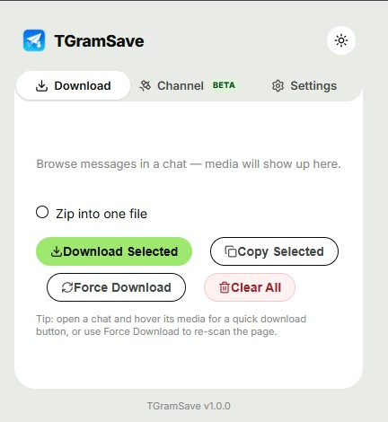
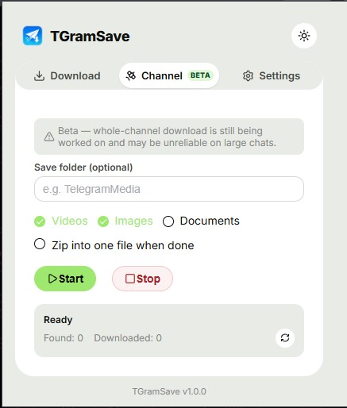
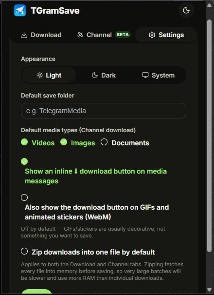

<div align="center">
  

  # TGramSave

  **Modern Telegram Web media downloader** — a browser extension that adds one-click download buttons for videos, images, and documents directly inside [web.telegram.org](https://web.telegram.org), plus a popup for batch downloads and whole-channel scraping.

  [](LICENSE)
  [](public)
  [](https://vuejs.org)
  [](CHANGELOG.md)

> Unofficial. Not affiliated with, endorsed by, or connected to Telegram FZ-LLC in any way.
</div>

## Screenshots

<div align="center">
  
  
  
</div>

## Features

- **Inline download buttons** — a small ⬇ button appears under every media message in a chat; grouped/album messages (multiple photos or videos in one message) get a button per item plus a "Download all" button for the group.
- **Batch download popup** — every media item found while you browse is cataloged into the extension's popup, where you can select some or all of it, download individually, zip everything into one archive, or copy direct links. The list updates live as new media is found — no need to reopen the popup.
- **Whole-channel download** *(beta)* — auto-scrolls a chat from top to bottom and downloads every matching video/image/document it finds along the way.
- **Byte-correct downloads** — reconstructs files via range-chunked fetches with gap/size validation instead of a single naive fetch, so large videos come out complete and playable rather than truncated.
- **GIF/sticker filtering** — animated GIFs and stickers are skipped by default (they're rarely something you want to "download"); enable them per-item in Settings if you do.
- **Light / dark / system theme**, configurable default save folder, and per-type (video/image/document) filtering for channel downloads.

## Installation (from source)

This isn't published to the Chrome Web Store — load it as an unpacked extension:

```bash
git clone https://github.com/psnwd/TGramSave.git
cd TGramSave
make install   # or: bun install
make build     # or: bun run build
```

Then in Chrome/Edge/Brave:

1. Go to `chrome://extensions`
2. Enable **Developer mode** (top right)
3. Click **Load unpacked** and select the `dist` folder

Reload the extension from `chrome://extensions` after every rebuild, and hard-refresh any open `web.telegram.org` tabs to pick up the new content scripts.

## Development

```bash
make dev        # Vite dev build, watches src/ and rebuilds into dist/
make typecheck  # vue-tsc --noEmit only
make build      # type-check, then production build into dist/
make package    # build, then zip dist/ into tgramsave.zip
make icons      # regenerate public/icons/{16,32,48,128}.png from a master.png
```

(`make` just wraps the equivalent `bun run <script>` commands — see the [Makefile](Makefile) — so plain `bun` (or `npm`) works too if you don't have `make`.)

## How it works

- **`src/content-script/`** — runs in Telegram's isolated content-script world; scans the DOM for media messages, injects download buttons, and catalogs found items into `chrome.storage` for the popup.
- **`src/content-script-inject/`** — runs in the page's own **MAIN world** (declared via manifest `world: "MAIN"`, not the old `<script src>` injection trick), since it needs same-origin access to Telegram's `blob:`/streaming URLs that an isolated content script can't reliably touch. Does the actual byte-range fetching, reassembly, and `<a download>` trigger.
- **`src/channel-downloader/`** — the whole-channel auto-scroll-and-download feature.
- **`src/background/`** — MV3 service worker: routes messages between content scripts and the popup, drives `chrome.downloads` for the channel downloader, and maintains the toolbar badge count.
- **`src/popup/`** — the Vue 3 + Element Plus popup UI (Download / Channel / Settings tabs).

## Permissions

| Permission | Why |
|---|---|
| `storage` | Cataloging found media, saving settings |
| `activeTab` | Talking to the current Telegram tab from the popup |
| `downloads`, `downloads.open` | Only used by the channel downloader's bulk-download path |
| `host_permissions: web.telegram.org` | The extension only ever runs on Telegram Web — nowhere else |

No `webRequest`/`declarativeNetRequest` — downloads work by fetching with the page's own session/cookies, not by intercepting or rewriting network traffic.

## Contributing

Issues and PRs welcome. Please run `make typecheck` before submitting.

## Star History

<a href="https://www.star-history.com/?repos=psnwd%2FTGramSave&type=date&legend=top-left">
 <picture>
   <source media="(prefers-color-scheme: dark)" srcset="https://api.star-history.com/chart?repos=psnwd/TGramSave&type=date&theme=dark&legend=top-left&sealed_token=Fn72sZw-O4hbdyL6C4q2OZPUMaOYC3bHlAXgPgbEEBnmoOiV67T2ekKccexASEvsEsxY6kTQfWzWIwvCz90dCUaa2pmNK7sfAiuzzvrFAtg71bTVNjGdytIZUNJRHwdFqaLmFQXPKRmpxVYEN5aAJn_Lya4r2pV0WbzwXs8i5g5RK0KismslIQCWgB-x" />
   <source media="(prefers-color-scheme: light)" srcset="https://api.star-history.com/chart?repos=psnwd/TGramSave&type=date&legend=top-left&sealed_token=Fn72sZw-O4hbdyL6C4q2OZPUMaOYC3bHlAXgPgbEEBnmoOiV67T2ekKccexASEvsEsxY6kTQfWzWIwvCz90dCUaa2pmNK7sfAiuzzvrFAtg71bTVNjGdytIZUNJRHwdFqaLmFQXPKRmpxVYEN5aAJn_Lya4r2pV0WbzwXs8i5g5RK0KismslIQCWgB-x" />
   
 </picture>
</a>

## License

[Apache License 2.0](LICENSE)
